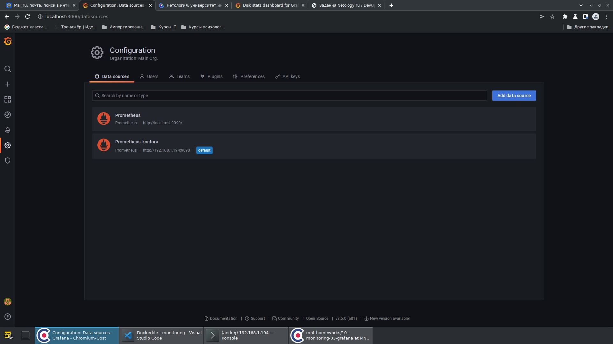
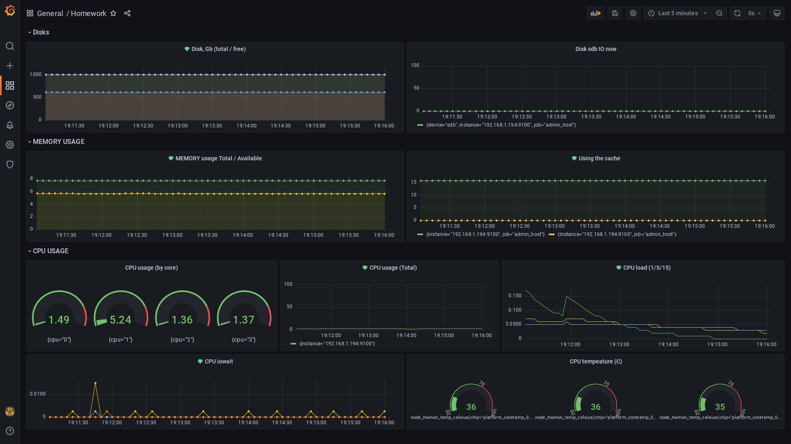
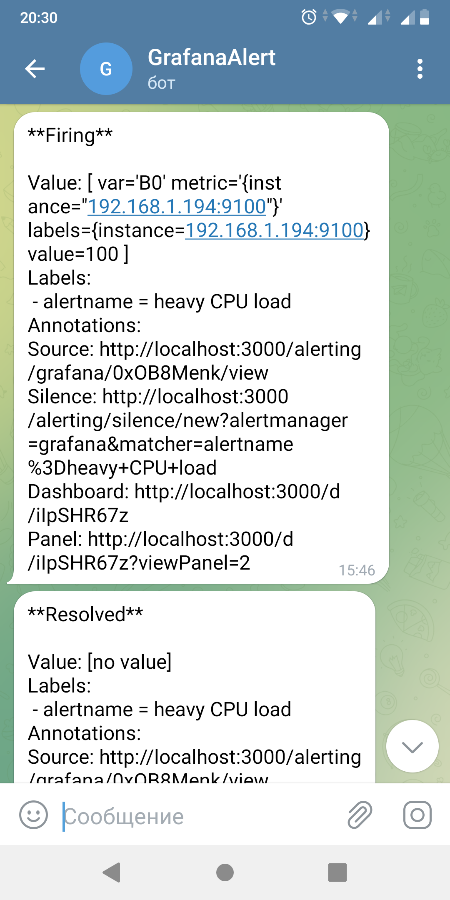

# Домашнее задание к занятию "10.03. Grafana"

Просто стащить готовый стек и развернуть его - это не интересно. К тому же у меня есть возможность использвоать слудебные машины.

У нас небольшая органиазция, имеем почтовый сервер (alt), сервер виртуализации (alt), несколько машин в других городах (альт), два десятка машин в офисе (зопарк из винды и альтов). Вот поэтому решил развернуть мониторинг самостоятельно.

Изначально планировал заставить ansible поднимать prometheus и grafana в докер-контейнерах, а на узлы ставить экспортеры, причём в зависимости от ОС, на альт - nodeexporter, на винду (куда ж без неё? сложно избавиться) windows_exporter.

Однако не имея существенного опыта в таких делах и имея ограниченный срок в рамках задания, пока что удалось всё сделать так:

-  Созданы образы на основе alt для node_exporter и prometheus

Ссылки на образы на DockerHub: 
#### Node_exporter:
https://hub.docker.com/layers/246646931/nargamard/nargamard/node_exporter/images/sha256-71f2d55ad1f20329b44028216598ad3eb4ec0fb41cb6dacbb146d0f5f5f58574?context=repo

Содержимое Dockerfile:
```
FROM alt:latest

ADD https://github.com/prometheus/node_exporter/releases/download/v1.3.1/node_exporter-1.3.1.linux-amd64.tar.gz .
RUN tar xvzf node_exporter-1.3.1.linux-amd64.tar.gz --directory /bin/
WORKDIR /bin/node_exporter-1.3.1.linux-amd64
ENV PATH=${PATH}:/bin/node_exporter-1.3.1.linux-amd64

CMD [ "node_exporter" ]

```

#### Prometheus: 
https://hub.docker.com/layers/246645082/nargamard/nargamard/prometheus/images/sha256-db06d4dc00d63291f9d6ddf9cd1ad5783d08d4b222dc5f480eb37f325bf33dd0?context=repo

Содержимое Dockerfile:
```
FROM alt:latest

ADD https://github.com/prometheus/prometheus/releases/download/v2.36.2/prometheus-2.36.2.linux-amd64.tar.gz .
RUN tar xvzf prometheus-2.36.2.linux-amd64.tar.gz --directory /bin/
WORKDIR /bin/prometheus-2.36.2.linux-amd64
ENV PATH=${PATH}:/bin/prometheus-2.36.2.linux-amd64
COPY prometheus.yml .

CMD [ "prometheus" ]

```

Содержимое prometheus.yml
```
global:
  scrape_interval:     5s
  evaluation_interval: 5s

scrape_configs:
  - job_name: 'admin_host'
    scrape_interval: 1s
    static_configs:
      - targets: ['nodeexporter:9100']
```

- Grafana установил на своей машине (просто apt-get install grafana)

---

## Задание 1
```
Используя директорию help внутри данного домашнего задания - 
запустите связку prometheus-grafana.

Зайдите в веб-интерфейс графана, используя авторизационные данные, 
указанные в манифесте docker-compose.

Подключите поднятый вами prometheus как источник данных.

Решение домашнего задания - скриншот веб-интерфейса grafana со 
списком подключенных Datasource.
```
Ответ:



---

## Задание 2
```
Изучите самостоятельно ресурсы:

promql-for-humans
understanding prometheus cpu metrics
Создайте Dashboard и в ней создайте следующие Panels:

Утилизация CPU для nodeexporter (в процентах, 100-idle)
CPULA 1/5/15
Количество свободной оперативной памяти
Количество места на файловой системе
Для решения данного ДЗ приведите promql запросы для выдачи этих 
метрик, а также скриншот получившейся Dashboard.
```
Ответ:

Утилизация CPU для nodeexporter (в процентах, 100-idle) - `100 - (avg by (instance) (rate(node_cpu_seconds_total{job="admin_host",mode="idle"}[1m])) * 100)`

CPULA 1 - `node_load1{job="admin_host"}` 

CPULA 5 - `node_load5{job="admin_host"}`

CPULA 15 - `node_load15{job="admin_host"}`

Количество свободной оперативной памяти - `node_memory_MemAvailable_bytes{job="admin_host"}/1073741824`

Количество места на файловой системе - `node_filesystem_avail_bytes{job="admin_host",fstype="ext4"}/1024/1024/1024*10`



Кроме указанных, решил добавить температуру ЦПУ (кстати, вопрос: почему 3 показометра?), утилизацию по ядрам, использование свопа и iowait процессора.

## Задание 3
```
Создайте для каждой Dashboard подходящее правило alert (можно обратиться к первой лекции в блоке "Мониторинг").

Для решения ДЗ - приведите скриншот вашей итоговой Dashboard.
```

Алерты повесил такие:
- Disk full (node_filesystem_avail_bytes{job="admin_host",fstype="ext4"}/1024/1024/1024*10 < 400)

- heavy CPU load (100 - (avg by (instance) (rate(node_cpu_seconds_total{job="admin_host",mode="idle"}[1m])) * 100) > 80)

- heavy CPU LA (node_load5{job="admin_host"} > 4)

- low level of available memory (node_memory_MemAvailable_bytes{job="admin_host"} / node_memory_MemTotal_bytes{job="admin_host"} * 100 < 20)

- CPU iowait detected (rate(node_cpu_seconds_total{job="admin_host",mode="iowait"}[5s]) > 0.1)

- Using Cache (node_memory_SwapCached_bytes{job="admin_host"}/1073741824 > 0,2)

Вопрос: почему нет кнопки "Alerts" в панели, которая отображает температуру ЦПУ?

Прилагаю скриншот:

 


## Задание 4
```
Сохраните ваш Dashboard.

Для этого перейдите в настройки Dashboard, выберите в боковом меню "JSON MODEL".

Далее скопируйте отображаемое json-содержимое в отдельный файл и сохраните его.

В решении задания - приведите листинг этого файла.
```

Ответ: 

<details>

  <summary>JSON MODEL</summary>

```
{
  "annotations": {
    "list": [
      {
        "builtIn": 1,
        "datasource": {
          "type": "grafana",
          "uid": "-- Grafana --"
        },
        "enable": true,
        "hide": true,
        "iconColor": "rgba(0, 211, 255, 1)",
        "name": "Annotations & Alerts",
        "target": {
          "limit": 100,
          "matchAny": false,
          "tags": [],
          "type": "dashboard"
        },
        "type": "dashboard"
      }
    ]
  },
  "editable": true,
  "fiscalYearStartMonth": 0,
  "graphTooltip": 0,
  "id": 2,
  "links": [],
  "liveNow": false,
  "panels": [
    {
      "collapsed": false,
      "gridPos": {
        "h": 1,
        "w": 24,
        "x": 0,
        "y": 0
      },
      "id": 18,
      "panels": [],
      "title": "Disks",
      "type": "row"
    },
    {
      "datasource": {
        "type": "prometheus",
        "uid": "0UhGgRenk"
      },
      "fieldConfig": {
        "defaults": {
          "color": {
            "mode": "palette-classic"
          },
          "custom": {
            "axisLabel": "",
            "axisPlacement": "auto",
            "barAlignment": 0,
            "drawStyle": "line",
            "fillOpacity": 6,
            "gradientMode": "none",
            "hideFrom": {
              "legend": false,
              "tooltip": false,
              "viz": false
            },
            "lineInterpolation": "linear",
            "lineWidth": 1,
            "pointSize": 5,
            "scaleDistribution": {
              "type": "linear"
            },
            "showPoints": "auto",
            "spanNulls": false,
            "stacking": {
              "group": "A",
              "mode": "none"
            },
            "thresholdsStyle": {
              "mode": "off"
            }
          },
          "mappings": [],
          "min": 0,
          "thresholds": {
            "mode": "absolute",
            "steps": [
              {
                "color": "green"
              },
              {
                "color": "red",
                "value": 80
              }
            ]
          }
        },
        "overrides": []
      },
      "gridPos": {
        "h": 6,
        "w": 12,
        "x": 0,
        "y": 1
      },
      "id": 20,
      "options": {
        "legend": {
          "calcs": [],
          "displayMode": "hidden",
          "placement": "bottom"
        },
        "tooltip": {
          "mode": "single",
          "sort": "none"
        }
      },
      "pluginVersion": "8.5.0",
      "targets": [
        {
          "datasource": {
            "type": "prometheus",
            "uid": "0UhGgRenk"
          },
          "editorMode": "code",
          "expr": "node_filesystem_size_bytes{job=\"admin_host\",fstype=\"ext4\"}/1024/1024/1024*10",
          "legendFormat": "__auto",
          "range": true,
          "refId": "A"
        },
        {
          "datasource": {
            "type": "prometheus",
            "uid": "0UhGgRenk"
          },
          "expr": "node_filesystem_avail_bytes{job=\"admin_host\",fstype=\"ext4\"}/1024/1024/1024*10",
          "hide": false,
          "refId": "B"
        }
      ],
      "title": "Disk, Gb (total / free)",
      "type": "timeseries"
    },
    {
      "datasource": {
        "type": "prometheus",
        "uid": "0UhGgRenk"
      },
      "fieldConfig": {
        "defaults": {
          "color": {
            "mode": "palette-classic"
          },
          "custom": {
            "axisLabel": "",
            "axisPlacement": "auto",
            "barAlignment": 0,
            "drawStyle": "line",
            "fillOpacity": 0,
            "gradientMode": "none",
            "hideFrom": {
              "legend": false,
              "tooltip": false,
              "viz": false
            },
            "lineInterpolation": "linear",
            "lineWidth": 1,
            "pointSize": 5,
            "scaleDistribution": {
              "type": "linear"
            },
            "showPoints": "auto",
            "spanNulls": false,
            "stacking": {
              "group": "A",
              "mode": "none"
            },
            "thresholdsStyle": {
              "mode": "off"
            }
          },
          "mappings": [],
          "thresholds": {
            "mode": "absolute",
            "steps": [
              {
                "color": "green"
              },
              {
                "color": "red",
                "value": 80
              }
            ]
          }
        },
        "overrides": []
      },
      "gridPos": {
        "h": 6,
        "w": 12,
        "x": 12,
        "y": 1
      },
      "id": 24,
      "options": {
        "legend": {
          "calcs": [],
          "displayMode": "list",
          "placement": "bottom"
        },
        "tooltip": {
          "mode": "single",
          "sort": "none"
        }
      },
      "pluginVersion": "8.5.0",
      "targets": [
        {
          "datasource": {
            "type": "prometheus",
            "uid": "0UhGgRenk"
          },
          "expr": "rate(node_disk_io_now{device=\"sdb\",job=\"admin_host\"}[$__interval])",
          "refId": "A"
        }
      ],
      "title": "Disk sdb IO now",
      "type": "timeseries"
    },
    {
      "collapsed": false,
      "gridPos": {
        "h": 1,
        "w": 24,
        "x": 0,
        "y": 7
      },
      "id": 10,
      "panels": [],
      "title": "MEMORY USAGE",
      "type": "row"
    },
    {
      "datasource": {
        "type": "prometheus",
        "uid": "0UhGgRenk"
      },
      "description": "",
      "fieldConfig": {
        "defaults": {
          "color": {
            "mode": "palette-classic"
          },
          "custom": {
            "axisLabel": "",
            "axisPlacement": "auto",
            "barAlignment": 0,
            "drawStyle": "line",
            "fillOpacity": 8,
            "gradientMode": "none",
            "hideFrom": {
              "legend": false,
              "tooltip": false,
              "viz": false
            },
            "lineInterpolation": "smooth",
            "lineWidth": 1,
            "pointSize": 5,
            "scaleDistribution": {
              "type": "linear"
            },
            "showPoints": "auto",
            "spanNulls": false,
            "stacking": {
              "group": "A",
              "mode": "none"
            },
            "thresholdsStyle": {
              "mode": "off"
            }
          },
          "mappings": [],
          "min": 0,
          "thresholds": {
            "mode": "absolute",
            "steps": [
              {
                "color": "green"
              },
              {
                "color": "red",
                "value": 80
              }
            ]
          }
        },
        "overrides": [
          {
            "__systemRef": "hideSeriesFrom",
            "matcher": {
              "id": "byNames",
              "options": {
                "mode": "exclude",
                "names": [
                  "{instance=\"192.168.1.194:9100\", job=\"admin_host\"}"
                ],
                "prefix": "All except:",
                "readOnly": true
              }
            },
            "properties": [
              {
                "id": "custom.hideFrom",
                "value": {
                  "legend": false,
                  "tooltip": false,
                  "viz": true
                }
              }
            ]
          }
        ]
      },
      "gridPos": {
        "h": 6,
        "w": 12,
        "x": 0,
        "y": 8
      },
      "id": 6,
      "options": {
        "legend": {
          "calcs": [],
          "displayMode": "hidden",
          "placement": "right"
        },
        "tooltip": {
          "mode": "single",
          "sort": "none"
        }
      },
      "pluginVersion": "8.5.0",
      "targets": [
        {
          "datasource": {
            "type": "prometheus",
            "uid": "0UhGgRenk"
          },
          "editorMode": "code",
          "expr": "node_memory_MemTotal_bytes{job=\"admin_host\"}/1073741824",
          "legendFormat": "{{label_name}}",
          "range": true,
          "refId": "A"
        },
        {
          "datasource": {
            "type": "prometheus",
            "uid": "0UhGgRenk"
          },
          "editorMode": "code",
          "exemplar": false,
          "expr": "node_memory_MemAvailable_bytes{job=\"admin_host\"}/1073741824",
          "hide": false,
          "legendFormat": "{{label_name}}",
          "range": true,
          "refId": "B"
        }
      ],
      "title": "MEMORY usage Total / Available",
      "transformations": [],
      "type": "timeseries"
    },
    {
      "datasource": {
        "type": "prometheus",
        "uid": "0UhGgRenk"
      },
      "description": "",
      "fieldConfig": {
        "defaults": {
          "color": {
            "mode": "palette-classic"
          },
          "custom": {
            "axisLabel": "",
            "axisPlacement": "auto",
            "barAlignment": 0,
            "drawStyle": "line",
            "fillOpacity": 5,
            "gradientMode": "none",
            "hideFrom": {
              "legend": false,
              "tooltip": false,
              "viz": false
            },
            "lineInterpolation": "linear",
            "lineWidth": 1,
            "pointSize": 5,
            "scaleDistribution": {
              "type": "linear"
            },
            "showPoints": "auto",
            "spanNulls": false,
            "stacking": {
              "group": "A",
              "mode": "none"
            },
            "thresholdsStyle": {
              "mode": "off"
            }
          },
          "mappings": [],
          "min": 0,
          "thresholds": {
            "mode": "absolute",
            "steps": [
              {
                "color": "green"
              },
              {
                "color": "red",
                "value": 80
              }
            ]
          }
        },
        "overrides": [
          {
            "__systemRef": "hideSeriesFrom",
            "matcher": {
              "id": "byNames",
              "options": {
                "mode": "exclude",
                "names": [
                  "{instance=\"192.168.1.194:9100\", job=\"admin_host\"}"
                ],
                "prefix": "All except:",
                "readOnly": true
              }
            },
            "properties": [
              {
                "id": "custom.hideFrom",
                "value": {
                  "legend": false,
                  "tooltip": false,
                  "viz": true
                }
              }
            ]
          }
        ]
      },
      "gridPos": {
        "h": 6,
        "w": 12,
        "x": 12,
        "y": 8
      },
      "id": 12,
      "options": {
        "legend": {
          "calcs": [],
          "displayMode": "list",
          "placement": "bottom"
        },
        "tooltip": {
          "mode": "single",
          "sort": "none"
        }
      },
      "targets": [
        {
          "datasource": {
            "type": "prometheus",
            "uid": "0UhGgRenk"
          },
          "expr": "node_memory_SwapTotal_bytes{job=\"admin_host\"}/1073741824",
          "refId": "A"
        },
        {
          "datasource": {
            "type": "prometheus",
            "uid": "0UhGgRenk"
          },
          "expr": "node_memory_SwapCached_bytes{job=\"admin_host\"}/1073741824",
          "hide": false,
          "refId": "B"
        }
      ],
      "title": "Using the cache",
      "type": "timeseries"
    },
    {
      "collapsed": false,
      "gridPos": {
        "h": 1,
        "w": 24,
        "x": 0,
        "y": 14
      },
      "id": 8,
      "panels": [],
      "title": "CPU USAGE",
      "type": "row"
    },
    {
      "datasource": {
        "type": "prometheus",
        "uid": "0UhGgRenk"
      },
      "fieldConfig": {
        "defaults": {
          "color": {
            "mode": "thresholds"
          },
          "mappings": [],
          "max": 100,
          "min": 0,
          "thresholds": {
            "mode": "absolute",
            "steps": [
              {
                "color": "green"
              },
              {
                "color": "red",
                "value": 80
              }
            ]
          }
        },
        "overrides": []
      },
      "gridPos": {
        "h": 6,
        "w": 8,
        "x": 0,
        "y": 15
      },
      "id": 4,
      "options": {
        "orientation": "auto",
        "reduceOptions": {
          "calcs": [
            "lastNotNull"
          ],
          "fields": "",
          "values": false
        },
        "showThresholdLabels": false,
        "showThresholdMarkers": true
      },
      "pluginVersion": "8.5.0",
      "targets": [
        {
          "datasource": {
            "type": "prometheus",
            "uid": "0UhGgRenk"
          },
          "expr": "100 - (avg by (cpu) (rate(node_cpu_seconds_total{job=\"admin_host\",mode=\"idle\"}[1m])) * 100)",
          "refId": "A"
        }
      ],
      "title": "CPU usage (by core)",
      "type": "gauge"
    },
    {
      "datasource": {
        "type": "prometheus",
        "uid": "0UhGgRenk"
      },
      "fieldConfig": {
        "defaults": {
          "color": {
            "mode": "palette-classic"
          },
          "custom": {
            "axisLabel": "",
            "axisPlacement": "auto",
            "barAlignment": 0,
            "drawStyle": "line",
            "fillOpacity": 0,
            "gradientMode": "none",
            "hideFrom": {
              "legend": false,
              "tooltip": false,
              "viz": false
            },
            "lineInterpolation": "linear",
            "lineWidth": 1,
            "pointSize": 5,
            "scaleDistribution": {
              "type": "linear"
            },
            "showPoints": "auto",
            "spanNulls": false,
            "stacking": {
              "group": "A",
              "mode": "none"
            },
            "thresholdsStyle": {
              "mode": "off"
            }
          },
          "mappings": [],
          "max": 100,
          "min": 0,
          "thresholds": {
            "mode": "absolute",
            "steps": [
              {
                "color": "green"
              },
              {
                "color": "red",
                "value": 80
              }
            ]
          }
        },
        "overrides": []
      },
      "gridPos": {
        "h": 6,
        "w": 7,
        "x": 8,
        "y": 15
      },
      "id": 2,
      "options": {
        "legend": {
          "calcs": [],
          "displayMode": "list",
          "placement": "bottom"
        },
        "tooltip": {
          "mode": "single",
          "sort": "none"
        }
      },
      "targets": [
        {
          "datasource": {
            "type": "prometheus",
            "uid": "0UhGgRenk"
          },
          "expr": "100 - (avg by (instance) (rate(node_cpu_seconds_total{job=\"admin_host\",mode=\"idle\"}[1m])) * 100)",
          "refId": "A"
        }
      ],
      "title": "CPU usage (Total)",
      "type": "timeseries"
    },
    {
      "datasource": {
        "type": "prometheus",
        "uid": "0UhGgRenk"
      },
      "description": "",
      "fieldConfig": {
        "defaults": {
          "color": {
            "mode": "palette-classic"
          },
          "custom": {
            "axisLabel": "",
            "axisPlacement": "auto",
            "barAlignment": 0,
            "drawStyle": "line",
            "fillOpacity": 0,
            "gradientMode": "none",
            "hideFrom": {
              "legend": false,
              "tooltip": false,
              "viz": false
            },
            "lineInterpolation": "linear",
            "lineWidth": 1,
            "pointSize": 5,
            "scaleDistribution": {
              "type": "linear"
            },
            "showPoints": "auto",
            "spanNulls": false,
            "stacking": {
              "group": "A",
              "mode": "none"
            },
            "thresholdsStyle": {
              "mode": "off"
            }
          },
          "mappings": [],
          "thresholds": {
            "mode": "absolute",
            "steps": [
              {
                "color": "green"
              },
              {
                "color": "red",
                "value": 80
              }
            ]
          }
        },
        "overrides": []
      },
      "gridPos": {
        "h": 6,
        "w": 9,
        "x": 15,
        "y": 15
      },
      "id": 14,
      "options": {
        "legend": {
          "calcs": [],
          "displayMode": "hidden",
          "placement": "bottom"
        },
        "tooltip": {
          "mode": "single",
          "sort": "none"
        }
      },
      "targets": [
        {
          "datasource": {
            "type": "prometheus",
            "uid": "0UhGgRenk"
          },
          "expr": "node_load1{job=\"admin_host\"}",
          "refId": "A"
        },
        {
          "datasource": {
            "type": "prometheus",
            "uid": "0UhGgRenk"
          },
          "expr": "node_load5{job=\"admin_host\"}",
          "hide": false,
          "refId": "B"
        },
        {
          "datasource": {
            "type": "prometheus",
            "uid": "0UhGgRenk"
          },
          "expr": "node_load15{job=\"admin_host\"}",
          "hide": false,
          "refId": "C"
        }
      ],
      "title": "CPU load (1/5/15)",
      "type": "timeseries"
    },
    {
      "datasource": {
        "type": "prometheus",
        "uid": "0UhGgRenk"
      },
      "fieldConfig": {
        "defaults": {
          "color": {
            "mode": "palette-classic"
          },
          "custom": {
            "axisLabel": "",
            "axisPlacement": "auto",
            "barAlignment": 0,
            "drawStyle": "line",
            "fillOpacity": 0,
            "gradientMode": "none",
            "hideFrom": {
              "legend": false,
              "tooltip": false,
              "viz": false
            },
            "lineInterpolation": "linear",
            "lineWidth": 1,
            "pointSize": 5,
            "scaleDistribution": {
              "type": "linear"
            },
            "showPoints": "auto",
            "spanNulls": false,
            "stacking": {
              "group": "A",
              "mode": "none"
            },
            "thresholdsStyle": {
              "mode": "off"
            }
          },
          "mappings": [],
          "thresholds": {
            "mode": "absolute",
            "steps": [
              {
                "color": "green"
              },
              {
                "color": "red",
                "value": 80
              }
            ]
          }
        },
        "overrides": []
      },
      "gridPos": {
        "h": 5,
        "w": 12,
        "x": 0,
        "y": 21
      },
      "id": 22,
      "options": {
        "legend": {
          "calcs": [],
          "displayMode": "hidden",
          "placement": "bottom"
        },
        "tooltip": {
          "mode": "single",
          "sort": "none"
        }
      },
      "targets": [
        {
          "datasource": {
            "type": "prometheus",
            "uid": "0UhGgRenk"
          },
          "expr": "rate(node_cpu_seconds_total{job=\"admin_host\",mode=\"iowait\"}[$__interval])",
          "refId": "A"
        }
      ],
      "title": "CPU iowait",
      "type": "timeseries"
    },
    {
      "datasource": {
        "type": "prometheus",
        "uid": "0UhGgRenk"
      },
      "fieldConfig": {
        "defaults": {
          "color": {
            "mode": "thresholds"
          },
          "mappings": [],
          "max": 100,
          "min": 20,
          "thresholds": {
            "mode": "absolute",
            "steps": [
              {
                "color": "green"
              },
              {
                "color": "red",
                "value": 70
              }
            ]
          }
        },
        "overrides": []
      },
      "gridPos": {
        "h": 5,
        "w": 12,
        "x": 12,
        "y": 21
      },
      "id": 16,
      "options": {
        "orientation": "auto",
        "reduceOptions": {
          "calcs": [
            "lastNotNull"
          ],
          "fields": "",
          "values": false
        },
        "showThresholdLabels": true,
        "showThresholdMarkers": true,
        "text": {
          "titleSize": 11
        }
      },
      "pluginVersion": "8.5.0",
      "targets": [
        {
          "datasource": {
            "type": "prometheus",
            "uid": "0UhGgRenk"
          },
          "expr": "node_hwmon_temp_celsius{job=\"admin_host\"}",
          "refId": "A"
        },
        {
          "datasource": {
            "type": "prometheus",
            "uid": "0UhGgRenk"
          },
          "hide": false,
          "refId": "B"
        }
      ],
      "title": "CPU tempeature (C)",
      "type": "gauge"
    }
  ],
  "refresh": "5s",
  "schemaVersion": 36,
  "style": "dark",
  "tags": [],
  "templating": {
    "list": []
  },
  "time": {
    "from": "now-5m",
    "to": "now"
  },
  "timepicker": {},
  "timezone": "",
  "title": "Homework",
  "uid": "iIpSHR67z",
  "version": 14,
  "weekStart": ""
}
```

  </details>